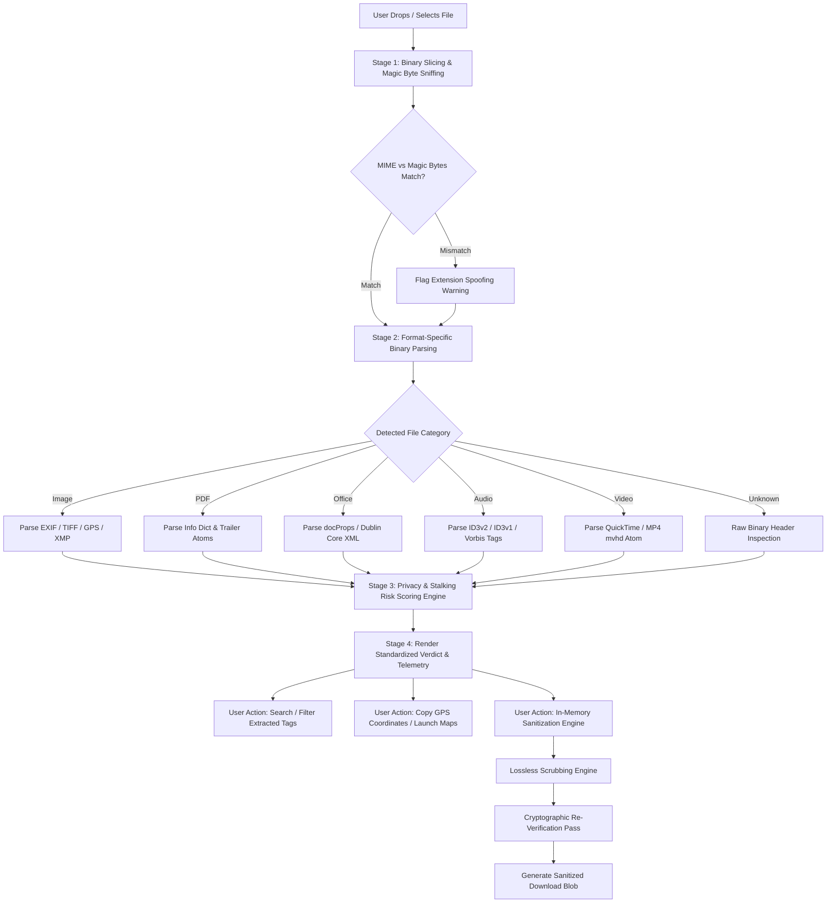

# File Metadata & Privacy Inspector — Architecture & Technical Documentation

## 1. Executive Summary & Purpose

The **File Metadata & Privacy Inspector** is a client-side digital forensics and privacy auditing module embedded directly within **CyberCouncil's Security Console** (`src/components/FileMetadataInspectorView.jsx` and `tool-dashboard.html`). It empowers citizens, journalists, whistleblowers, digital forensics analysts, and students to inspect, discover, and scrub hidden forensic metadata embedded inside digital media and corporate documents **before sharing them online**.

### Core Architecture Highlights
* **100% In-Browser Local Execution**: The inspector runs exclusively inside client memory (browser JavaScript, Web APIs, and typed array DataViews). Files are **never uploaded to any server, cloud API, or third-party service**, ensuring total confidentiality for sensitive documents, personal photographs, and privileged investigative evidence.
* **Magic Byte Ground-Truth Identification**: Unlike basic operating system dialogs that rely on untrusted file extensions (which attackers frequently spoof to disguise payloads), the inspector reads raw binary magic bytes (the first 16 to 64 bytes) to determine the true underlying container format.
* **Multi-Format Parsing Suite**: Custom binary parsers extract metadata structures across 6 major format categories:
  1. **Raster Images**: JPEG (EXIF APP1 segment), PNG (tEXt/iTXt chunks), WebP (EXIF RIFF chunks), GIF87a/89a.
  2. **PDF Documents**: Cross-reference tables, Info dictionaries (`/Author`, `/Creator`, `/Producer`, `/CreationDate`, `/ModDate`), and XMP metadata packets.
  3. **Microsoft 365 / OpenXML Documents**: DOCX, XLSX, and PPTX packages (inspecting Dublin Core XML properties, revision counters, editing authors, and corporate templates).
  4. **Audio Streams**: MP3 (ID3v2.2, ID3v2.3, ID3v2.4 frames and ID3v1 trailers), WAV (INFO LIST chunks), OGG Vorbis comments, and FLAC metadata blocks.
  5. **Video Containers**: MP4, M4V, and QuickTime MOV (parsing `moov` and `mvhd` atom headers, creation epoch offsets, and encoder signatures).
* **Automated Privacy & Stalking Risk Scoring**: Heuristically assesses whether extracted tags expose real-world physical locations (GPS coordinates), internal hostnames, corporate network structures, camera serial numbers, or personal identifying usernames.
* **Client-Side In-Memory Sanitization**: Provides lossless stripping engines (HTML5 Canvas rendering, byte-preserving OpenXML redaction, and ID3 frame slicing) with an automated post-sanitization cryptographic verification pass.
* **Statutory Indian Cyber Law Compliance**: Contextualizes discovered privacy violations against statutory provisions under Sections 66E, 72, and 43A of the Indian Information Technology Act, 2000.

---

## 2. System Architecture & Component Integration

```
+-------------------------------------------------------------------------------------------------+
|                                    CYBERCOUNCIL SECURITY CONSOLE                                |
+------------------------------------+------------------------------------------------------------+
| LEFT SIDEBAR / NAVIGATION          | MAIN WORKSPACE CONTAINER (.payload-scanner-workspace)      |
|                                    |                                                            |
|  * Threat Inspection               |  [When activeView === 'metadata']                          |
|    - Phishing Scanner              |    -> .scanner-top-bar (Breadcrumbs & Module Badge)         |
|    - Payload Scanner               |    -> .scanner-hero-card (Hero Content & Privacy Box)      |
|    - Password Auditor              |                                                            |
|                                    |  [Screen A: Initial Upload]                                |
|  * Digital Forensics               |    -> .payload-scanner-card (.file-dropzone)               |
|    - Metadata Inspector <----+     |    -> .scanner-samples-row (1-Click Realistic Samples)      |
|    - Network Inspector       |     |                                                            |
|    - Social Engineering      +---> |  [Screen B: Processing State]                              |
|                              |     |    -> .scan-progress-strip (Binary Sniffing Progress)     |
|  * Legal & Incident Portal   |     |                                                            |
|    - Statutory Law Matrix          |  [Screen C: Forensics & Inspection Report]                 |
|    - Incident Report System        |    -> .verdict-box (Danger / Caution / Clean)              |
|                                    |    -> .stats-breakdown-row (4-Metric Executive Telemetry)  |
|                                    |    -> .selected-file-header (File Info & Reset Button)     |
|                                    |    -> .flagged-engines-card (Media Thumbnail Preview)      |
|                                    |    -> .safety-guidance-card (GPS Alert & Map Links)        |
|                                    |    -> .safety-guidance-card (Identified Privacy Risks)     |
|                                    |    -> .flagged-engines-card (Sanitization & Download)     |
|                                    |    -> .flagged-engines-card (Tag Explorer & Search Filter) |
|                                    |    -> .technical-details-card (Collapsible Binary Specs)   |
|                                    |    -> .safety-guidance-card (Indian IT Act Reference)      |
|                                    |    -> .scanner-bottom-actions (Export JSON / Reset)        |
+------------------------------------+------------------------------------------------------------+
```

### 2.1 Navigation & State Management
In `src/pages/ToolDashboard.jsx`, the tool is registered under the unified state router:
```javascript
const [activeView, setActiveView] = useState('modules'); // 'modules' | 'metadata' | 'payload' | ...
```
When selected via the left sidebar or the tool grid card ("File Metadata & Privacy Inspector"), `setActiveView('metadata')` unmounts the module grid and renders `FileMetadataInspectorView` with the props:
```jsx
<FileMetadataInspectorView onBack={() => setActiveView('modules')} />
```

---

## 3. End-to-End Forensics Pipeline



---

## 4. Technical Implementation of Inspection Engines

### 4.1 Binary Magic Byte Signature Sniffing
The inspector uses the browser's `File.slice(0, 16).arrayBuffer()` to extract the leading bytes into a `Uint8Array` and matches them against binary signatures:

| Format Category | Target Extension | Magic Byte Signature (Hexadecimal) | Technical Specification |
|:----------------|:-----------------|:-----------------------------------|:------------------------|
| **JPEG** | `.jpg`, `.jpeg` | `FF D8 FF` | Joint Photographic Experts Group SOI marker |
| **PNG** | `.png` | `89 50 4E 47 0D 0A 1A 0A` | Portable Network Graphics header |
| **GIF** | `.gif` | `47 49 46 38` (`GIF8`) | Graphics Interchange Format (87a or 89a) |
| **WebP** | `.webp` | `52 49 46 46 ... 57 45 42 50` | RIFF container with WEBP chunk identifier |
| **PDF** | `.pdf` | `25 50 44 46` (`%PDF`) | Adobe Portable Document Format header |
| **OpenXML Office**| `.docx`, `.xlsx`, `.pptx` | `50 4B 03 04` (`PK\x03\x04`) | ZIP archive signature containing `[Content_Types].xml` |
| **MP3 Audio** | `.mp3` | `49 44 33` (`ID3`) or `FF FB` / `FF F3` | ID3v2 container or MPEG-1 Audio Layer III sync word |
| **WAV Audio** | `.wav` | `52 49 46 46 ... 57 41 56 45` | RIFF container with WAVE format chunk |
| **MP4 / MOV** | `.mp4`, `.mov` | `.... 66 74 79 70` (`ftyp`) | ISO Base Media File Format box |

If the user's declared MIME type conflicts with the detected magic byte signature (e.g., an executable `.exe` disguised as an `.jpg`), the tool triggers an immediate security alert warning of file extension spoofing.

---

### 4.2 Image EXIF & GPS Parser Engine (`extractImageMetadata`)
For JPEG files, the parser locates the `APP1` marker (`0xFF 0xE1`):
1. **TIFF Header & Endianness**: Determines byte alignment (`0x49 0x49` for Intel Little-Endian or `0x4D 0x4D` for Motorola Big-Endian).
2. **IFD0 (Primary Image Directory)**:
   - Camera Manufacturer (`0x010F`), Model (`0x0110`), Orientation (`0x0112`).
   - Software / Firmware Version (`0x0131`), Date/Time Modified (`0x0132`).
3. **SubIFD (Exif Offset `0x8769`)**:
   - Exposure Time (`0x829A`), F-Number (`0x829D`), ISO Speed (`0x8827`).
   - Date/Time Original (`0x9003`), Focal Length (`0x920A`), Lens Model (`0xA434`).
   - Camera Serial Number (`0xC62F`).
4. **GPS IFD (Offset `0x8825`)**:
   - Reads Degrees, Minutes, and Seconds (DMS) rational pairs (each rational is represented as `numerator / denominator`).
   - Converts DMS to standard Decimal Degrees:
     $$\text{Decimal} = \text{Degrees} + \frac{\text{Minutes}}{60} + \frac{\text{Seconds}}{3600}$$
   - Applies directional negation if `GPSLatitudeRef === 'S'` or `GPSLongitudeRef === 'W'`.
   - Extracts Altitude (`GPSAltitude`), Timestamp (`GPSTimeStamp`), and Positioning Reference System (`GPSMapDatum`).

---

### 4.3 PDF Document Forensics (`extractPdfMetadata`)
The PDF engine parses both binary trailer records and text object streams:
1. **Info Dictionary Extraction**:
   - Regular expressions scan for `/Title`, `/Author`, `/Subject`, `/Creator`, and `/Producer`.
   - Creation Date (`/CreationDate (D:YYYYMMDDHHmmSS)`) and Modification Date (`/ModDate`) are parsed, converting standard PDF date format strings into localized citizen timestamps.
2. **Security & Cryptography Flags**:
   - Inspects for the `/Encrypt` dictionary to determine whether user or owner passwords and DRM restrictions are active.
3. **XMP Stream Carving**:
   - Carves `<xmp:ModifyDate>`, `<xmp:MetadataDate>`, and `<pdf:Producer>` from embedded XML packets.

---

### 4.4 Microsoft Office OpenXML Parser (`extractOfficeMetadata`)
DOCX, XLSX, and PPTX files are standard ZIP containers packaging structured XML files. The parser reads the leading 256 KB of the archive in Latin-1 binary encoding to carve `docProps/core.xml` and `docProps/app.xml`:
* **Dublin Core Creator**: `<dc:creator>` identifies the username of the user who originated the document.
* **Last Modified By**: `<cp:lastModifiedBy>` identifies internal IT usernames or workstation profiles.
* **Corporate Details**: `<Company>` and `<Manager>` tags reveal corporate structure.
* **Editing Timeline**: `<dcterms:created>` and `<dcterms:modified>` timestamps reveal internal deadlines and work schedules.
* **Revision Metrics**: `<cp:revision>` exposes the internal document draft cycle.

---

### 4.5 Audio & Video Metadata Engines
* **ID3v2 Audio Parser (`extractAudioMetadata`)**:
  - Identifies ID3v2 header flags and sync-safe size calculations.
  - Carves standard ID3v2 frames: `TIT2` (Title), `TPE1` (Lead Artist), `TALB` (Album), `TYER`/`TDRC` (Recording Year), `TCON` (Genre), and `TSSE` (Encoder / Software settings like LAME or iTunes build).
* **QuickTime / MP4 Video Parser (`extractVideoMetadata`)**:
  - Locates the `mvhd` (Movie Header) atom.
  - Reads the 32-bit creation time integer (measured in seconds since midnight, January 1, 1904 UTC).
  - Converts Macintosh epoch time to Unix epoch time:
    $$\text{Epoch}_{\text{Unix}} = (\text{Epoch}_{\text{Mac}} - 2082844800) \times 1000$$
  - Carves encoder signatures matching tools such as HandBrake, Apple QuickTime, Lavf (FFmpeg), Adobe Premiere, GoPro, and Sony.

---

## 5. Automated Privacy Risk Scoring Engine

The risk engine analyzes all extracted key-value pairs against heuristic security criteria:

| Severity Level | Trigger Conditions | Security & Stalking Implication |
|:---------------|:-------------------|:---------------------------------|
| **HIGH PRIVACY RISK** (Red) | • Embedded GPS coordinates (`Latitude`, `Longitude`)<br>• Personal Author Identity (`Author`, `dc:creator`)<br>• Internal Editor Identity (`lastModifiedBy`)<br>• Company / Organization affiliation | Anyone downloading the file can pinpoint the exact home, office, or school location of the creator or identify internal staff usernames. |
| **MODERATE RISK** (Amber) | • Camera serial numbers (`SerialNumber`)<br>• Exact creation and modification timestamps<br>• Hardware device model (`iPhone 15 Pro`, `Canon EOS R5`)<br>• Operating software build (`Word 365`, `Photoshop 2024`) | Exposes victim device hardware fingerprints and software versions that attackers can use to tailor targeted exploits or track physical equipment. |
| **NO DETECTED RISK** (Green) | • No identifying personal tags or location data found | Safe for public distribution or verified post-sanitization. |

---

## 6. Client-Side Sanitization & Verification Engine

Citizens can scrub sensitive metadata in-memory without installing third-party utilities:

```
[Uploaded File] ──► [Sanitization Engine] ──► [Clean Blob] ──► [Re-Verification Pass] ──► [Download]
```

### 6.1 Image Sanitization (`sanitizeImageFile`)
1. Instantiates a private in-memory HTML5 Canvas element.
2. Draws the original image onto the 2D canvas context (`ctx.drawImage`).
3. Re-encodes the raw pixel buffer to a fresh Blob via `canvas.toBlob(..., 'image/jpeg', 0.95)` or `'image/png'`.
4. **Result**: All non-pixel headers—including EXIF, GPS, IPTC, camera serials, and XMP packets—are stripped.

### 6.2 OpenXML Document Sanitization (`sanitizeOfficeFile`)
1. Reads the document bytes into an array buffer.
2. Identifies XML property tags (`<dc:creator>`, `<cp:lastModifiedBy>`, `<Company>`, `<Application>`).
3. Overwrites tag contents in place with byte-length-preserving spaces to prevent ZIP stream corruption or archive CRC mismatch.
4. Generates a new downloadable Office document blob.

### 6.3 MP3 Audio Sanitization (`sanitizeMp3File`)
1. Reads the ID3v2 header to determine sync-safe frame size ($10 + \text{size}$).
2. Detects trailing ID3v1 tags (last 128 bytes starting with `TAG`).
3. Slices the audio stream from the end of ID3v2 to the start of ID3v1 (`uint8.slice(startOffset, endOffset)`).
4. Produces a 100% clean MPEG audio stream without recompressing or degrading audio quality.

### 6.4 Verification Guarantee
Before presenting the "Download Sanitized File" button, the engine executes an **immediate second-pass forensic inspection** over the newly generated blob. Only if the remaining sensitive tag count equals zero is the verification badge displayed.

---

## 7. Legal & Statutory Reference (Indian IT Act, 2000)

The tool connects forensic findings with citizen legal rights under Indian Cyber Law:

* **Section 66E — Violation of Privacy**: Capturing, publishing, or transmitting images of private areas of any person without consent carries up to **3 years imprisonment** or a fine of up to ₹2,00,000.
* **Section 72 — Penalty for Breach of Confidentiality**: Any person who has secured access to any electronic record, book, or material without the consent of the person concerned and discloses such material is punishable with up to **2 years imprisonment** or a fine of up to ₹1,00,000.
* **Section 43A — Compensation for Failure to Protect Data**: Corporate bodies possessing sensitive personal data in a computer resource who fail to implement reasonable security practices face uncapped liability for compensation to victims.

Citizens discovering unauthorized tracking or metadata leakage can directly click **"File Incident Report"** to navigate to `reports.html` and begin an official statutory report.

---

## 8. Summary of Supported Formats & Capabilities

| File Type Category | Extensions Supported | Extracted Telemetry | In-Browser Sanitization |
|:-------------------|:---------------------|:--------------------|:-----------------------|
| **Digital Photographs** | `.jpg`, `.jpeg`, `.png`, `.webp`, `.gif` | Camera model, lens specs, exposure settings, ISO, serial numbers, exact GPS coordinates, altitude, orientation. | ✅ Yes (Lossless Canvas Scrubber) |
| **PDF Documents** | `.pdf` | Author names, creation dates, modification dates, PDF creator application, encrypted security flags, producer libraries. | ℹ️ Read-Only (Sanitization via PDF re-print recommended) |
| **Microsoft Office 365** | `.docx`, `.xlsx`, `.pptx` | Dublin Core author, last modified by, corporate affiliation, application version, document revision count, created/modified timestamps. | ✅ Yes (Byte-Preserving XML Redactor) |
| **Audio Files** | `.mp3`, `.wav`, `.ogg`, `.flac` | Track title, artist, album, recording year, genre, encoder signature, studio tags. | ✅ Yes (Direct Stream Slicing for MP3) |
| **Video Files** | `.mp4`, `.mov`, `.m4v` | Creation timestamp (Mac epoch translation), encoder software profile, format branding. | ℹ️ Read-Only |
| **Raw Binaries** | Any format | Magic bytes hex representation, container classification, extension spoofing alert. | ℹ️ Read-Only |
