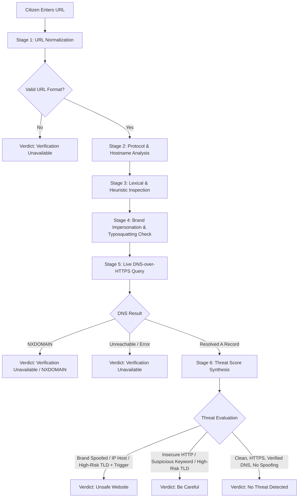

# Phishing & Domain Scanner — Architecture & Workflow Documentation

## 1. Executive Summary & Purpose

The **Phishing & Domain Scanner** is an integrated threat inspection tool built directly into **CyberCouncil's Individual Security Console** (`tool-dashboard.html`). It enables citizens, students, and cybersecurity analysts to safely evaluate suspicious links, SMS phishing (smishing) links, fraudulent banking messages, and deceptive emails **without opening them in their browser**.

### Core Design Principles
* **Integrated Workspace**: Embedded directly into `tool-dashboard.html`. When triggered, it seamlessly replaces the central module grid while keeping the top navigation header and left sidebar intact and operational.
* **Real Verification, Not Static Mockups**: Performs actual live network inspections via public **DNS-over-HTTPS (DoH)**, checking DNS record presence, IP resolution, protocol security, brand spoofing, and high-risk domain heuristics.
* **100% Free-Tier & Zero Cost**: Operates entirely with zero paid API dependencies, zero required API keys, and zero secret exposure in client-side code.
* **Citizen-Friendly Verdicts**: Translates complex technical telemetry (DNS status codes, TLD reputation, homograph characters) into four clear, intuitive verdicts:
  1. `No Threat Detected` (Safe / Green)
  2. `Be Careful` (Caution / Amber)
  3. `Unsafe Website` (Malicious / Red)
  4. `Verification Unavailable` (Neutral / Gray)
* **Dual-Environment Support**: Provides a modern, reactive component implementation in Vite/React (`src/components/PhishingScannerView.jsx`) and a fallback vanilla JavaScript implementation in static HTML (`tool-dashboard.html`).

---

## 2. System Architecture & UI Integration

```
+-------------------------------------------------------------------------------------------------+
|                                    CYBERCOUNCIL TOP NAVBAR                                      |
+------------------------------------+------------------------------------------------------------+
| LEFT SIDEBAR                       | MAIN WORKSPACE AREA                                        |
|                                    |                                                            |
|  * Operations                      |  [When activeView === 'modules']                           |
|    - Overview                      |    -> Hero Banner & Telemetry Strip (8/8 Active)           |
|    - Security Modules              |    -> Category Tabs & Live Search                          |
|                                    |    -> 8 Security Module Cards (EXIF, Hash, etc.)           |
|  * THREAT INSPECTION               |                                                            |
|    - Phishing Scanner <------+     |  [When activeView === 'phishing']                          |
|    - Password Auditor        |     |    -> Breadcrumb / "<- Back to Security Modules"          |
|    - Network Inspector       |     |    -> Phishing Scanner Hero Card & Input Field             |
|    - Social Engineering      |     |    -> Quick Sample Test Buttons (Clean, Unsafe, etc.)      |
|                              |     |    -> Live Verification Engine (DoH + Heuristics)          |
|  * Digital Forensics         +---> |    -> Verdict Banner (Safe / Amber / Danger / Neutral)     |
|    - Payload Scanner               |    -> Diagnostics Grid (URL, Protocol, DNS IP, Mode)       |
|    - Media Forensics               |    -> Identified Signals & Heuristic Flags                 |
|    - IP & Geolocation Trace        |    -> Citizen Safety Rules & Incident Escalation Link      |
+------------------------------------+------------------------------------------------------------+
```

### 2.1 Navigation & State Management
In the React application (`src/pages/ToolDashboard.jsx`), a single state variable controls the view:
```javascript
const [activeView, setActiveView] = useState('modules'); // 'modules' | 'phishing'
```
* **Entering the Scanner**:
  * Clicking **"Phishing Scanner"** under `THREAT INSPECTION` in the left sidebar sets `activeView = 'phishing'`.
  * Alternatively, clicking **"Launch Scanner"** on Tool Card #1 ("Phishing & Malicious Link Scanner") in the module grid also switches `activeView = 'phishing'`.
* **Returning to Modules**:
  * Clicking **"Back to Security Modules"** or clicking **"Security Modules"** in the sidebar resets `activeView = 'modules'`, instantly restoring the 8-card grid without reloading the webpage.
* **Static Fallback**:
  * In non-Vite environments, `modulesContainer` and `phishingScannerContainer` use DOM `style.display = 'none'` / `'block'` toggles managed by `showPhishingScanner()` and `hidePhishingScanner()`.

---

## 3. End-to-End Verification Pipeline

Whenever a citizen enters a URL and clicks **"Check Website"** (or selects one of the quick samples), the scanner executes a 6-stage pipeline:



### Stage 1: URL Normalization & Sanitization
* Trims leading/trailing whitespace.
* If the user omits the protocol (e.g. `sbi-bank.xyz` or `google.com`), the scanner automatically prepends `https://`.
* Evaluates syntax using the browser's native `new URL()` parser. If parsing fails, the scanner immediately returns `Verification Unavailable` with an invalid format flag.

### Stage 2: Transport Protocol & Hostname Checks
* **Transport Security (HTTPS vs HTTP)**: Verifies whether the site enforces Transport Layer Security (TLS/HTTPS). Unencrypted `http://` links transmit credentials in plaintext and are flagged.
* **Raw IP Hostname Detection**: Identifies whether the hostname is an IPv4 literal (e.g. `http://192.168.1.1` or `http://45.33.32.156`). Legitimate services use registered domain names; direct IP URLs are common indicators of malicious C2 nodes or phishing kits.
* **Punycode / Homograph Attack Detection**: Checks for internationalized domain names beginning with `xn--` or containing non-ASCII unicode characters used to visually impersonate English letters (e.g. `gооgle.com` using Cyrillic `о`).

### Stage 3: Lexical & Domain Risk Analysis
* **High-Risk Disposable TLDs**: Compares the top-level domain against known high-abuse extensions frequently used in throwaway phishing attacks:
  `xyz`, `top`, `click`, `buzz`, `cam`, `fit`, `gq`, `tk`, `ml`, `ga`, `cf`, `work`, `rest`, `country`, `stream`, `surf`, `loan`, `racing`, `download`.
* **Excessive Subdomain Nesting**: Detects domains with more than 3 levels of subdomains (e.g. `secure.login.verify.sbi.com.badsite.org`), excluding legitimate multi-part TLDs like `.co.in` or `.gov.in`.
* **Credential Lure Keywords**: Scans the domain name, path, and query string for sensitive phishing triggers:
  `login`, `signin`, `verify`, `verification`, `secure`, `banking`, `account-update`, `authenticate`, `wallet`, `alert`, `confirm`, `kyc`, `otp`, `claim-reward`, `unlock`.

### Stage 4: Brand Impersonation & Typosquatting Engine
Phishing links typically clone the name of trusted brands while hosting them on unauthorized domains. The scanner maintains a target database of frequently spoofed institutions in India and worldwide:

| Monitored Brand | Brand Key | Authorized Official Domains |
| :--- | :--- | :--- |
| **State Bank of India** | `sbi` | `onlinesbi.sbi`, `sbi.co.in` |
| **HDFC Bank** | `hdfc` | `hdfcbank.com`, `hdfc.com` |
| **ICICI Bank** | `icici` | `icicibank.com` |
| **Paytm** | `paytm` | `paytm.com` |
| **Income Tax India** | `incometax` | `incometax.gov.in` |
| **UIDAI / Aadhaar** | `uidai` | `uidai.gov.in` |
| **Google** | `google` | `google.com`, `google.co.in` |
| **Microsoft** | `microsoft` | `microsoft.com`, `live.com`, `outlook.com` |
| **Apple** | `apple` | `apple.com`, `icloud.com` |
| **Amazon** | `amazon` | `amazon.com`, `amazon.in` |
| **PayPal** | `paypal` | `paypal.com` |
| **Netflix** | `netflix` | `netflix.com` |

**Evaluation Logic**:
1. Does the inspected hostname contain the brand's key string (e.g. `sbi`)?
2. If yes, is the hostname an exact match or valid subdomain of an authorized domain in the whitelist?
3. If it contains `sbi` but is hosted on `sbi-kyc-update.xyz`, it is flagged as **Brand Impersonation**.

### Stage 5: Live DNS-over-HTTPS (DoH) Resolution
Rather than relying on simulated mock data or paid external threat intelligence APIs, the scanner queries authoritative public DNS servers via **DNS-over-HTTPS (RFC 8484)**:
* **Primary Resolver**: Cloudflare DoH (`https://cloudflare-dns.com/dns-query?name=<domain>&type=A`)
  * Request Headers: `Accept: application/dns-json`
  * Timeout: 6000ms via `AbortController`
* **Fallback Resolver**: Google Public DoH (`https://dns.google/resolve?name=<domain>&type=A`)
  * Timeout: 4000ms via `AbortController`

#### DNS Status Code Interpretation
* **Status 0 (`NOERROR`)**: Domain exists and is registered in global DNS roots. The scanner extracts the active `A` record IP addresses (e.g., `142.250.190.78`).
* **Status 3 (`NXDOMAIN`)**: Domain does **not exist** or has expired/been revoked in DNS registries.
* **Network Error / Timeout**: If the user is offline or the resolver cannot be reached, the system gracefully handles the exception without crashing.

---

## 4. Verdict Classification Matrix

The scanner maps all detected signals and DNS responses into four distinct citizen-facing verdicts:

| Verdict | Status Pill | Theme Color | Trigger Conditions | Citizen Explanation |
| :--- | :--- | :--- | :--- | :--- |
| **No Threat Detected** | `verdict-badge-safe` | Green (`#1f883d`) | Active DNS resolution (`NOERROR`), uses HTTPS, no brand spoofing, no high-risk TLDs, no suspicious keywords. | The website is actively registered, resolves to verified DNS servers, uses encryption, and shows no deceptive indicators. |
| **Be Careful** | `verdict-badge-amber` | Amber (`#9a6700`) | Unencrypted plain `http://`, OR high-risk TLD without brand spoofing, OR credential keywords in path. | The site does not use HTTPS encryption or exhibits structural attributes that warrant caution. Exercise vigilance before submitting data. |
| **Unsafe Website** | `verdict-badge-danger` | Red (`#cf222e`) | Detected brand impersonation (e.g. fake SBI/HDFC/Paytm), raw IP address used as hostname, or high-risk TLD combined with banking/KYC keywords. | Severe phishing indicators detected. Appears to impersonate a legitimate institution. Do not enter credentials, OTPs, or financial information. |
| **Verification Unavailable** | `verdict-badge-neutral` | Gray (`#57606a`) | Non-existent domain (`NXDOMAIN`), malformed URL format, DNS resolver timeout, or network offline. | The domain does not exist or authoritative DNS servers could not be contacted. |

---

## 5. Free-Tier & Zero Cost Compliance

The implementation strictly adheres to security and budget constraints:
1. **Zero Cost**: Neither CyberCouncil nor its users incur any recurring costs or metered API billing.
2. **No Secret Leaks**: No private tokens, API secrets, or credentials are hardcoded into frontend bundles (`dist/` or `src/`).
3. **No Paid Quota Failures**: Unlike commercial APIs (such as VirusTotal, Google Safe Browsing API, or URLScan) which enforce strict daily quotas or require credit card billing, public DoH endpoints are publicly funded infrastructure designed for universal internet resolution.
4. **Graceful Degradation**: If DoH queries are blocked by local firewalls or parental controls, the scanner fails safely to **"Verification Unavailable"** instead of crashing or misinforming the citizen.

---

## 6. Citizen Guidance & Escalation

To ensure the scanner is educational and actionable, the result screen includes:
* **Diagnostics Grid**:
  * Inspected Target URL
  * Transport Security status (`Encrypted (HTTPS)` vs `Unencrypted (HTTP)`)
  * DNS Resolution status with resolved public IPv4 address
  * Evaluation Mode notice
* **Identified Signals List**: Explains each heuristic trigger in clear, human language (e.g., *"Potential brand impersonation: matches 'State Bank of India' but is not on an official domain"*).
* **Copy Scan Report Button**: Copies a clean summary of the scan to the clipboard for sharing with technical support or filing with authorities.
* **Statutory Link & Incident Escalation**: Direct link to the **Incident Logs** (`reports.html`) to lodge a digital complaint under the Indian Information Technology Act, with reference to the National Cyber Crime Reporting Portal helpline (**1930**).

---

## 7. File & Code Structure Summary

| File | Purpose / Role |
| :--- | :--- |
| `src/components/PhishingScannerView.jsx` | React component containing the entire live scanning engine, DoH fetchers, brand checks, diagnostics UI, and safety guidance. |
| `src/pages/ToolDashboard.jsx` | Main dashboard shell managing `activeView` state, sidebar hooks, grid card launcher, and header navigation. |
| `src/styles/dashboard.css` | Styles for scanner hero card, search form, verdict badges, diagnostics grid, and animations. |
| `tool-dashboard.html` | Dual-mode HTML containing the React mount root (`#root`) and static fallback containers with inline DoH logic. |
| `css/tool-dashboard.css` | Companion responsive stylesheet for the static fallback containers. |

---

## 8. Verification & Demonstration Steps

To test the scanner live in your development environment:
1. Open the project at `http://localhost:5173/tool-dashboard.html`.
2. In the left sidebar under **THREAT INSPECTION**, click **Phishing Scanner**.
3. Use the quick sample buttons to test different scenarios:
   * **Clean (`https://google.com`)**: Returns **No Threat Detected** with live resolved IP address (e.g. `142.250.190.78`).
   * **Unsafe (`http://sbi-kyc-verify-login.xyz`)**: Returns **Unsafe Website** with brand impersonation warning for State Bank of India.
   * **Caution (`http://example.com`)**: Returns **Be Careful** due to unencrypted plain HTTP transport.
   * **Unavailable (`https://nonexistent-fake-domain-99999.org`)**: Returns **Verification Unavailable** with `NXDOMAIN` indication.
4. Click **Back to Security Modules** to verify instant return to the full 8-module suite.
